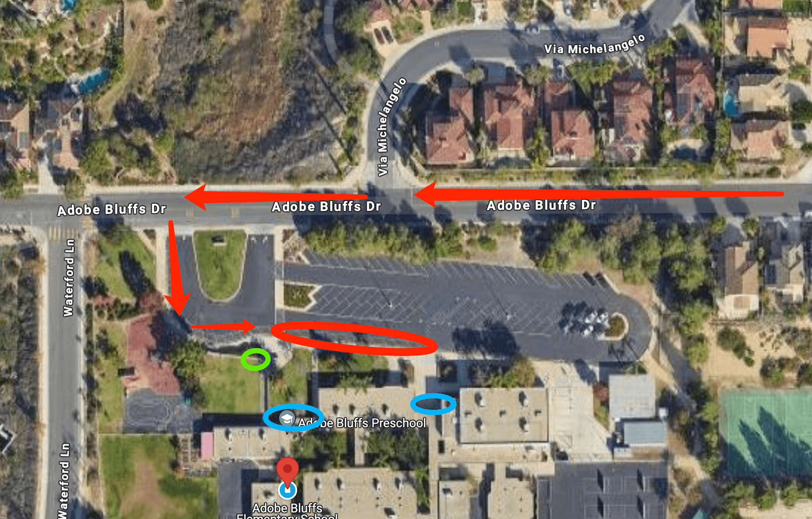

# 🚌 Adobe Bluffs — Pickup Instructions

**Address:** 8707 Adobe Bluffs Dr, San Diego, CA 92129  
**Last Verified:** 2025-08-11

---

## 📍 Pickup Spot
**Location:** Park the car by the curb of the driveway shown in the **red circle** on the map below.  

---

## 🛣️ Driver Route
1. Enter through the main school entrance on Adobe Bluffs Dr.  
2. Follow the driveway loop to the red circle area.  
3. Stop at the curb and remain in position until the student arrives.  
4. Exit the driveway carefully, following school traffic flow.

---

## 🕒 Dismissal Times

| Grade Level     | Mon / Tue / Wed / Fri | Thursday  |
|-----------------|-----------------------|-----------|
| All Grades      | 2:05 PM               | 12:25 PM  |

---

## 🧾 Student Pickup Instructions

### **TK**
- Students will exit from the **green circle** area on the map.  
- Driver must **walk to the green circle** to pick up the student.

### **Kindergarten & Up**
- Students will exit from the **blue circle** area on the map.  
- Driver should **stand by the side of the car** in the red circle zone.  
- Students will locate the driver and walk to the vehicle.

---

## ⚠ Safety Notes
- Do **not** leave the vehicle unattended in the pickup zone for long periods.  
- Always keep hazard awareness in school zones.  
- Ensure students are buckled in before moving.  

---

## 📞 Contacts
- **Dispatch:** See your driver sheet for phone/text contact.  
- **Corrections to this page:** [yihengy@graceallstaracademy.com](mailto:yihengy@graceallstaracademy.com)

---

[⬅ Back to Location List](../Location_detail.md) | [🏠 Homepage](../README.md)
