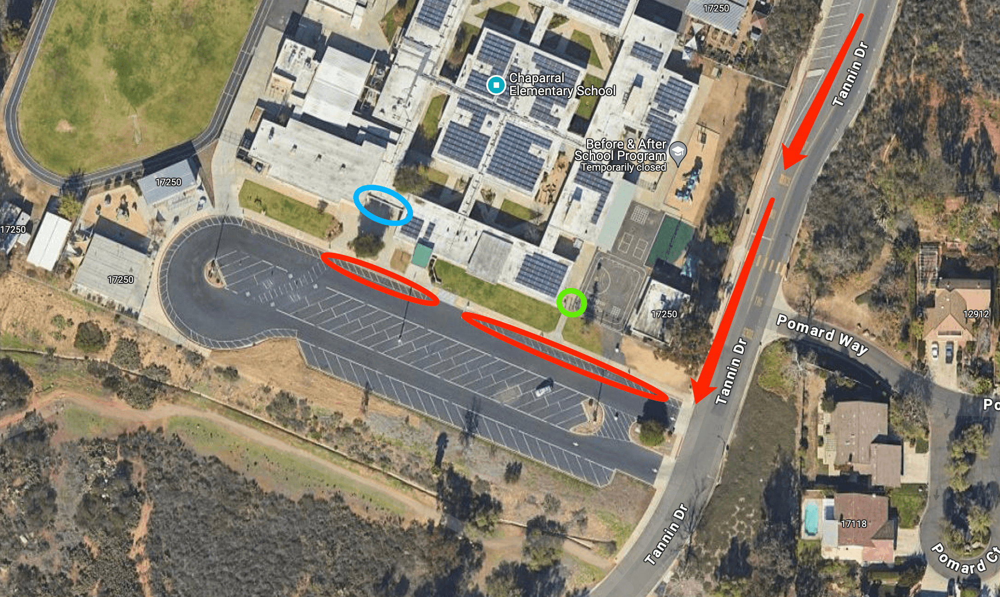

# 🚌 Chaparral — Pickup Instructions

**Address:** 17250 Tannin Dr, Poway, CA 92064  
**Last Verified:** 2025-08-11

---

## 📍 Pickup Spot
**Location:** Park the car by the curb of the driveway shown in the **red circle** on the map below.

---

## 🛣️ Driver Route
1. Enter through the main school entrance on Tannin Dr.  
2. Follow the driveway loop to the **red circle** pickup area.  
3. Stop and follow dismissal procedures for your assigned grade group.  
4. Exit the driveway carefully, following school traffic flow.

---

## 🕒 Dismissal Times

| Grade Level | Mon / Tue / Wed / Fri | Thursday |
|-------------|-----------------------|----------|
| TK–K        | 2:55 PM               | 1:20 PM  |
| 1st+        | 3:05 PM               | 1:20 PM  |

---

## 🧾 Student Pickup Instructions

### **TK**
- Students exit from the **green circle** area on the map.  
- Driver must **walk to the green circle** to pick up students.

### **1st Grade & Up**
- Students exit from the **blue circle** area on the map.  
- Driver should **stand by the side of the car** in the red circle zone.  
- Students will look for the driver and walk to the car.

---

## ⚠ Safety Notes
- Do not leave the vehicle unattended in the pickup zone for long periods.  
- Always keep hazard awareness in school zones.  
- Ensure students are buckled before moving.

---

## 📞 Contacts
- **Dispatch:** See your driver sheet for phone/text contact.  
- **Corrections to this page:** [yihengy@graceallstaracademy.com](mailto:yihengy@graceallstaracademy.com)

---

[⬅ Back to Location List](../Location_detail.md) | [🏠 Homepage](../README.md)
