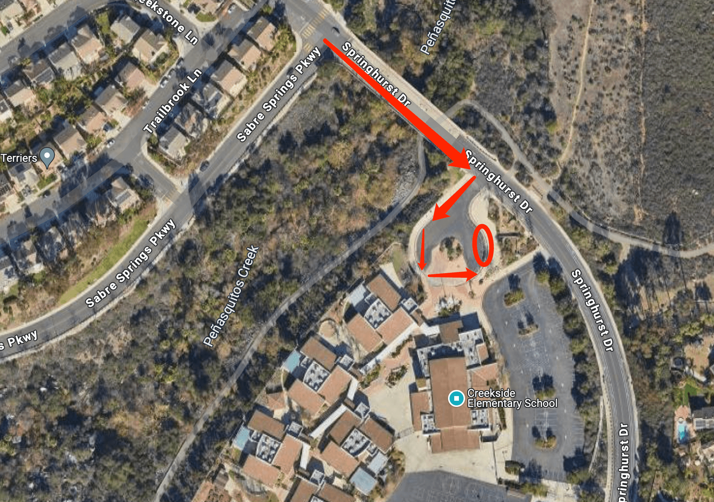

# 🚌 Creekside — Pickup Instructions

**Address:** 12362 Springhurst Dr, San Diego, CA 92128  
**Last Verified:** 2025-08-11

---

## 📍 Pickup Spot
**Location:** Follow the line and park by the curbside of the loop in the **red circle** area on the map below.  
This is a **drive-thru pickup zone** — remain in your vehicle and students will come to you.

---

## 🛣️ Driver Route
1. Enter the school driveway from Springhurst Dr.  
2. Follow the traffic line into the loop.  
3. Stop at the **red circle** pickup zone and stay inside the vehicle.  
4. Students will be released to your car.  
5. Exit the loop carefully, following school traffic rules.

---

## 🕒 Dismissal Times

| Grade Level | Mon / Tue / Wed / Fri | Thursday |
|-------------|-----------------------|----------|
| All Grades  | 3:05 PM               | 1:25 PM  |

---

## ⚠ Safety Notes
- Remain in your vehicle at all times in the pickup zone.  
- Do not block the flow of traffic or pedestrian crosswalks.  
- Ensure students are buckled before the vehicle moves.

---

## 📞 Contacts
- **Dispatch:** See your driver sheet for phone/text contact.  
- **Corrections to this page:** [yihengy@graceallstaracademy.com](mailto:yihengy@graceallstaracademy.com)

---

[⬅ Back to Location List](../Location_detail.md) | [🏠 Homepage](../README.md)
