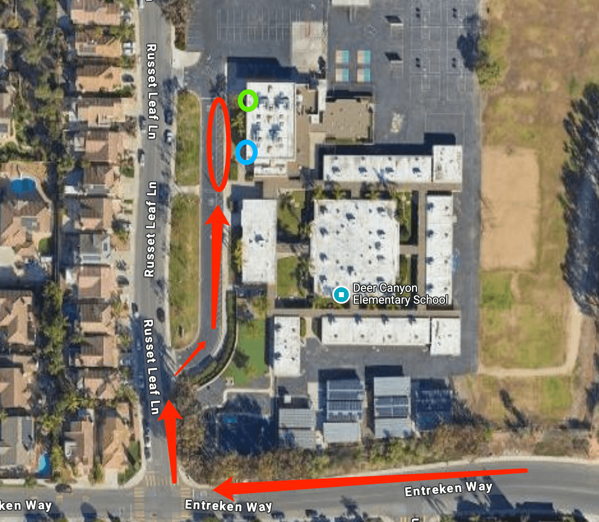

# 🚌 Deer Canyon — Pickup Instructions

**Address:** 13455 Russet Leaf Ln, San Diego, CA 92129  
**Last Verified:** 2025-08-11

---

## 📍 Pickup Spot
**Location:** Park the car by the curbside of the school in the **red circle** area on the map below.

---

## 🛣️ Driver Route
1. Enter the school driveway from Russet Leaf Ln.  
2. Park at the **red circle** curbside area.  
3. Follow dismissal steps by grade level (see below).  
4. Exit the school driveway carefully, following traffic guidelines.

---

## 🕒 Dismissal Times
| Grade Level | Mon / Tue / Wed / Fri | Thursday |
|-------------|-----------------------|----------|
| All Grades  | 3:05 PM               | 1:25 PM  |

---

## 🧾 Student Pickup Instructions

### **Kindergarten**
- Lock your vehicle and walk to the **green circle** area on the map.  
- An onsite teacher will assist in calling out the student.

### **1st Grade**
- After picking up kindergarten students, proceed to the **blue circle** area.  
- An onsite teacher will assist in calling out the student.

### **2nd Grade & Up**
- Students will walk directly to your car at the **red circle** curbside area.

---

## ⚠ Safety Notes
- Only leave your vehicle when picking up TK/K or 1st grade students as instructed.  
- Ensure your vehicle is locked when unattended.  
- Always buckle students before leaving the pickup area.

---

## 📞 Contacts
- **Dispatch:** See your driver sheet for phone/text contact.  
- **Corrections to this page:** [yihengy@graceallstaracademy.com](mailto:yihengy@graceallstaracademy.com)

---

[⬅ Back to Location List](../Location_detail.md) | [🏠 Homepage](../README.md)
