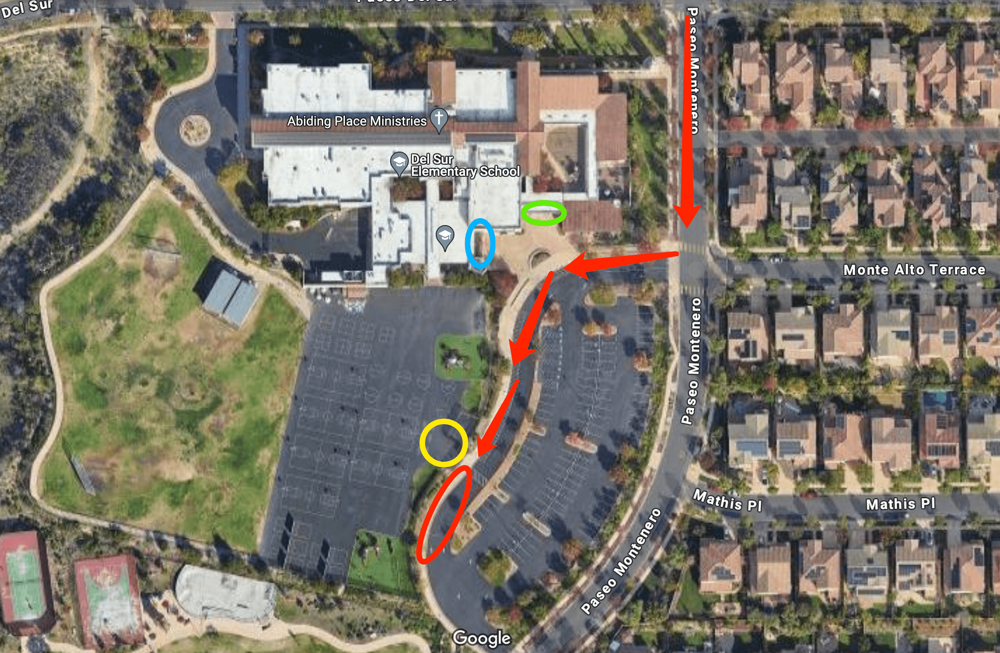

# 🚌 Del Sur — Pickup Instructions

**Address:** 15665 Paseo Del Sur, San Diego, CA 92127  
**Last Verified:** 2025-08-11

---

## 📍 Pickup Spot
**Location:** Park the car by the side of the school playground gate shown in the **red circle** on the map below.

---

## 🛣️ Driver Route
1. Enter and park at the **red circle** area near the playground gate.  
2. Follow the grade-specific pickup steps below.  
3. Exit the school area safely, following traffic rules.

---

## 🕒 Dismissal Times
| Grade Level | Mon / Tue / Wed / Fri | Thursday |
|-------------|-----------------------|----------|
| All Grades  | 3:05 PM               | 1:25 PM  |

---

## 🧾 Student Pickup Instructions

### **ESS & Kindergarten**
- Lock your vehicle and walk to the **green circle** area.  
- Pick up ESS and Kindergarten students first.  
- **ESS pickup:** Go inside the office — ask an onsite teacher for access instructions.

### **1st Grade**
- After picking up ESS and Kindergarten students, proceed to the **blue circle** area to pick up any 1st graders.

### **2nd Grade & Up**
- Proceed to the **yellow circle** area to pick up the remaining students.  
- Some older students may walk directly to your car.

---

## ⚠ Safety Notes
- Always lock your vehicle when leaving to pick up students.  
- Follow the order: **ESS & K → 1st → 2nd+** for efficient pickup.  
- Confirm that students are buckled before departing.

---

## 📞 Contacts
- **Dispatch:** See your driver sheet for phone/text contact.  
- **Corrections to this page:** [yihengy@graceallstaracademy.com](mailto:yihengy@graceallstaracademy.com)

---

[⬅ Back to Location List](../Location_detail.md) | [🏠 Homepage](../README.md)

