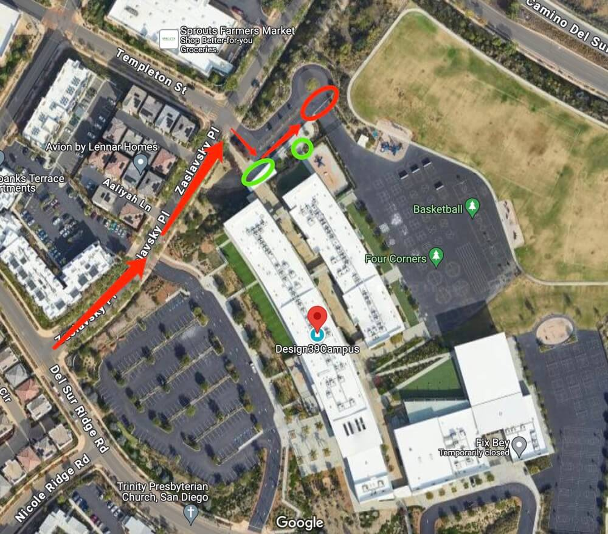

# 🚌 Design 39 — Pickup Instructions

**Address:** 17050 Del Sur Ridge Rd, San Diego, CA 92127  
**Last Verified:** 2025-08-11

---

## 📍 Pickup Spot
**Location:** Park the car by the curbside of the school driveway shown in the **red circle** on the map, in front of all the parent cars.  
Stand by the side of the car — students will look for you and come to the vehicle.

---

## 🛣️ Driver Route
1. Enter the school driveway from Del Sur Ridge Rd.  
2. Proceed directly to the **red circle** pickup zone in front of the parent line.  
3. Stand beside your vehicle for visibility so students can locate you.  
4. Exit the driveway safely once all assigned students are on board.

---

## 🕒 Dismissal Times

| Grade Level | Everyday |
|-------------|----------|
| All Grades  | 3:15 PM  |

---

## 🧾 Additional Notes
- **Arrive early** to secure your spot — it may be difficult to move to the front of the line after dismissal.  
- If arriving early, you may use the opposite-direction lane to reach the front **only if it is safe** and **before** dismissal time.  
- Coordinate with onsite staff if unsure about safe positioning.

---

## ⚠ Safety Notes
- Always follow school staff traffic guidance.  
- Ensure students are buckled before the vehicle moves.  
- Do not block other vehicles when positioning in the pickup zone.

---

## 📞 Contacts
- **Dispatch:** See your driver sheet for phone/text contact.  
- **Corrections to this page:** [yihengy@graceallstaracademy.com](mailto:yihengy@graceallstaracademy.com)

---

[⬅ Back to Location List](../Location_detail.md) | [🏠 Homepage](../README.md)
