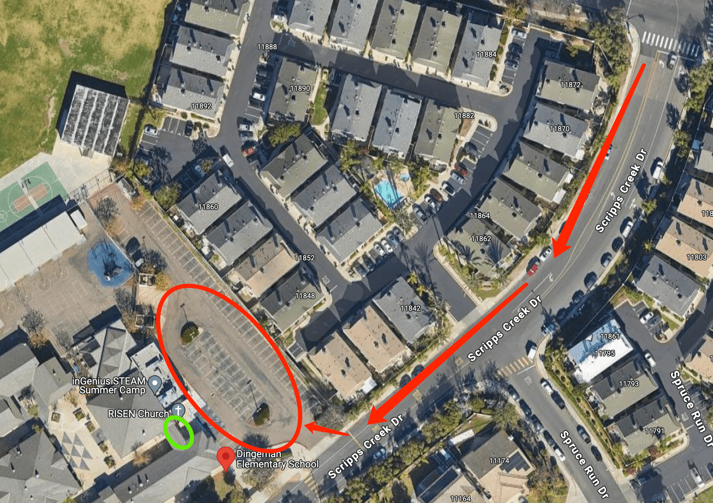

# 🚌 Dingeman — Pickup Instructions

**Address:** 11840 Scripps Creek Dr, San Diego, CA 92131  
**Last Verified:** 2025-08-11

---

## 📍 Pickup Spot
**Location:** Park the car in the school parking lot at the **red circle** on the map below.  
Stand by the **green circle** at the school’s front door — students will exit from this door and look for you.

---

## 🛣️ Driver Route
1. Enter the school parking lot from Scripps Creek Dr.  
2. Park at the **red circle** area as shown on the map.  
3. Walk to the **green circle** at the front door and wait for students.  
4. Once all assigned students arrive, return to your vehicle and exit the parking lot carefully.

---

## 🕒 Dismissal Times

| Grade Level | Mon / Tue / Wed / Fri | Thursday |
|-------------|-----------------------|----------|
| All Grades  | 3:00 PM               | 12:20 PM |

---

## ⚠ Safety Notes
- Always lock your vehicle when away from it to meet students.  
- Remain visible at the **green circle** location so students can find you quickly.  
- Ensure all students are buckled before departing.

---

## 📞 Contacts
- **Dispatch:** See your driver sheet for phone/text contact.  
- **Corrections to this page:** [yihengy@graceallstaracademy.com](mailto:yihengy@graceallstaracademy.com)

---

[⬅ Back to Location List](../Location_detail.md) | [🏠 Homepage](../README.md)
