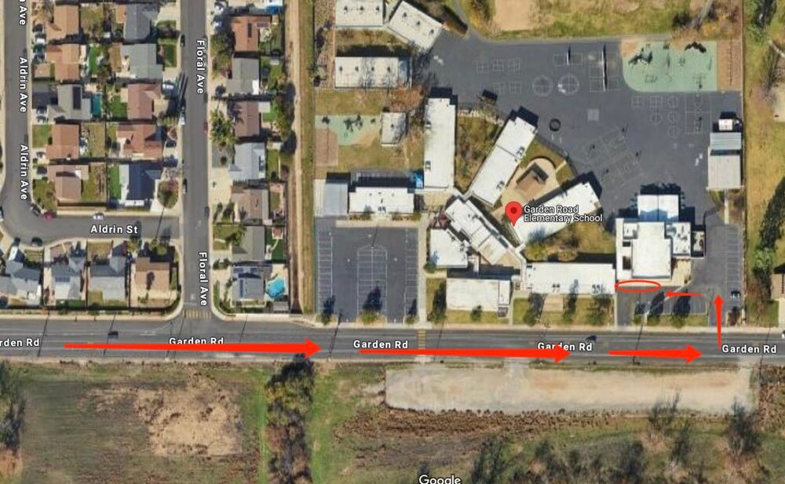

# 🚌 Garden Road — Pickup Instructions

**Address:** 14614 Garden Rd, Poway, CA 92064  
**Last Verified:** 2025-08-11

---

## 📍 Pickup Spot
**Location:** Line up the car in the **red circle** area on the map below.  
This is a **drive-thru pickup zone** — remain in your vehicle while the onsite teacher assists in locating and bringing students to you.

---

## 🛣️ Driver Route
1. Enter the school driveway from Garden Rd.  
2. Follow the traffic line to the **red circle** pickup area.  
3. Remain in your vehicle — the onsite teacher will bring students to you.  
4. Exit the pickup lane carefully, following the school’s traffic flow.

---

## 🕒 Dismissal Times

| Grade Level | Mon / Tue / Wed / Fri | Thursday |
|-------------|-----------------------|----------|
| All Grades  | 2:05 PM               | 12:25 PM |

---

## ⚠ Safety Notes
- Stay inside your vehicle in the drive-thru lane.  
- Do not block crosswalks or bus lanes.  
- Ensure students are buckled before moving the vehicle.

---

## 📞 Contacts
- **Dispatch:** See your driver sheet for phone/text contact.  
- **Corrections to this page:** [yihengy@graceallstaracademy.com](mailto:yihengy@graceallstaracademy.com)

---

[⬅ Back to Location List](../Location_detail.md) | [🏠 Homepage](../README.md)
