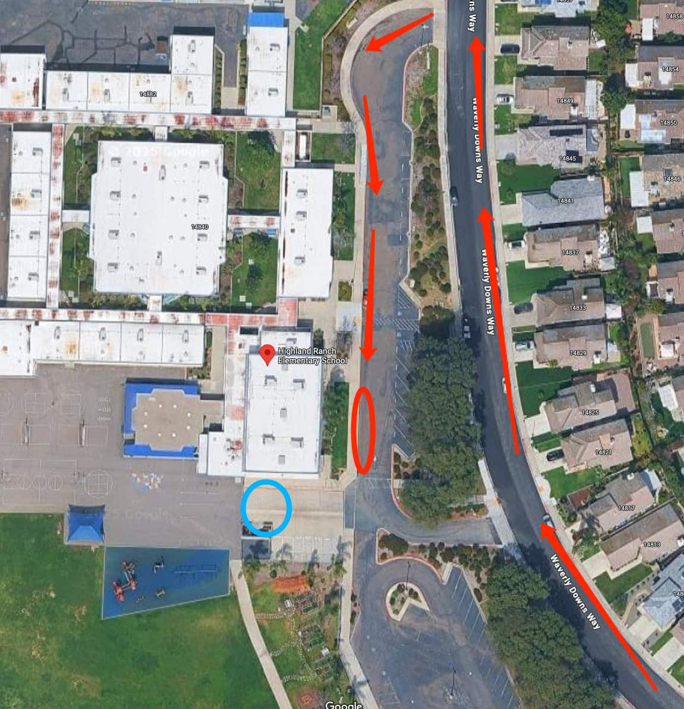

# 🚌 Highland Ranch — Pickup Instructions

**Address:** 14840 Waverly Downs Way, San Diego, CA 92128  
**Last Verified:** 2025-08-11

---

## 📍 Pickup Spot
**Location:** Park in the specific parking lot designated for school buses at the **red circle** on the map,  
or use the drive-thru/curbside pickup lane. Students will exit from the **blue circle** area.

---

## 🛣️ Driver Route
1. Enter from Waverly Downs Way.  
2. If parking in the **red circle** bus parking area, ensure your vehicle is not blocking bus operations.  
3. If using the drive-thru lane, proceed to the curbside pickup area.  
4. Students will exit from the **blue circle** location and come to your vehicle.  
5. Exit carefully, following the school’s traffic flow.

---

## 🕒 Dismissal Times
| Grade Level | Everyday |
|-------------|----------|
| All Grades  | 1:45 PM  |

---

## ⚠ Safety Notes
- Do not block bus movements when parked in the **red circle** area.  
- Follow school staff instructions for safe dismissal.  
- Ensure students are buckled before leaving the pickup zone.

---

## 📞 Contacts
- **Dispatch:** See your driver sheet for phone/text contact.  
- **Corrections to this page:** [yihengy@graceallstaracademy.com](mailto:yihengy@graceallstaracademy.com)

---

[⬅ Back to Location List](../Location_detail.md) | [🏠 Homepage](../README.md)
