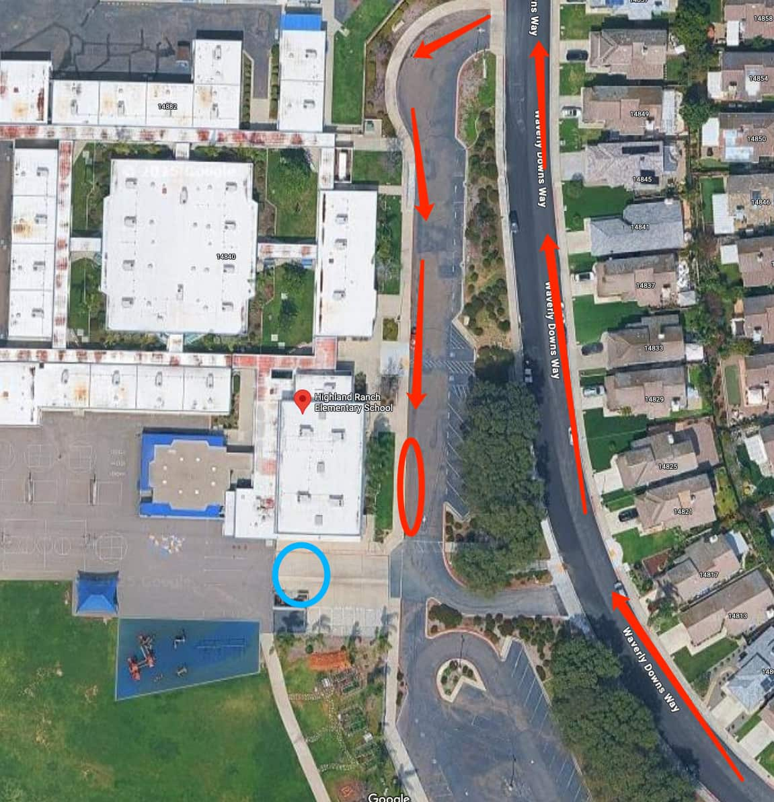

# 🚌 Highland Ranch — Pickup Instructions

**Address:** 14840 Waverly Downs Way, San Diego, CA 92128  
**Last Verified:** 2025-08-13

---

## 📍 Pickup Spot
**Location:** Follow along the **red arrows** to enter the parking lot and line up with other cars, it is drive-thru pickup and students will exit from the **blue circle** gate and find our van. (Notice, you may have to let the student see your van or you can wait outside the car and let student see you)

---

## 🛣️ Driver Route
1. Enter from Waverly Downs Way.  
2. If parking in the **red circle** parking lot, ensure your vehicle is locked.  
3. If using the drive-thru lane, proceed to the curbside pickup area.  
4. Students will exit from the **blue circle** location and come to your vehicle.  
5. Exit carefully, following the school’s traffic flow.

---

## 🕒 Dismissal Times

| Grade Level | Everyday |
|-------------|----------|
| All Grades  | 1:45 PM  |

---

## ⚠ Safety Notes 
- Follow school staff instructions for safe dismissal.  
- Ensure students are buckled before leaving the pickup zone.

---

## 📞 Contacts
- **Dispatch:** See your driver sheet for phone/text contact.  
- **Corrections to this page:** [yihengy@graceallstaracademy.com](mailto:yihengy@graceallstaracademy.com)

---

[⬅ Back to Location List](../Location_detail.md) | [🏠 Homepage](../README.md)
