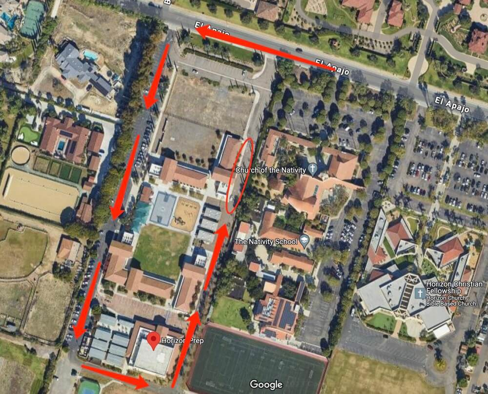

# 🚌 Horizon Prep — Pickup Instructions

**Address:** 6233 El Apajo, Rancho Santa Fe, CA 92067  
**Last Verified:** 2025-08-11

---

## 📍 Pickup Spot
**Location:** Line up the car in the **red circle** area on the map below.  
This is a **drive-thru pickup zone** — remain in your vehicle while the onsite teacher assists in locating and bringing students to you.

---

## 🛣️ Driver Route
1. Enter the school driveway and proceed to the **red circle** pickup zone.  
2. Follow staff directions for positioning your vehicle.  
3. Remain in your vehicle — the onsite teacher will bring students to you.  
4. Exit the driveway carefully, following school traffic flow.

---

## 🕒 Dismissal Times
| Grade Level | Everyday |
|-------------|----------|
| TK–K        | 2:30 PM  |
| 1st+        | 3:00 PM  |

---

## 🧾 Special Instructions

### **TK Pickup**
- TK students are dismissed at a **different location**.  
- Contact **Mr. Jeff** at **858-649-9760** for detailed instructions on TK pickup.

---

## ⚠ Safety Notes
- Remain in your vehicle in the drive-thru zone (except for TK pickup as directed).  
- Do not block crosswalks or bus lanes.  
- Ensure students are buckled before moving the vehicle.

---

## 📞 Contacts
- **Dispatch:** See your driver sheet for phone/text contact.  
- **Corrections to this page:** [yihengy@graceallstaracademy.com](mailto:yihengy@graceallstaracademy.com)  
