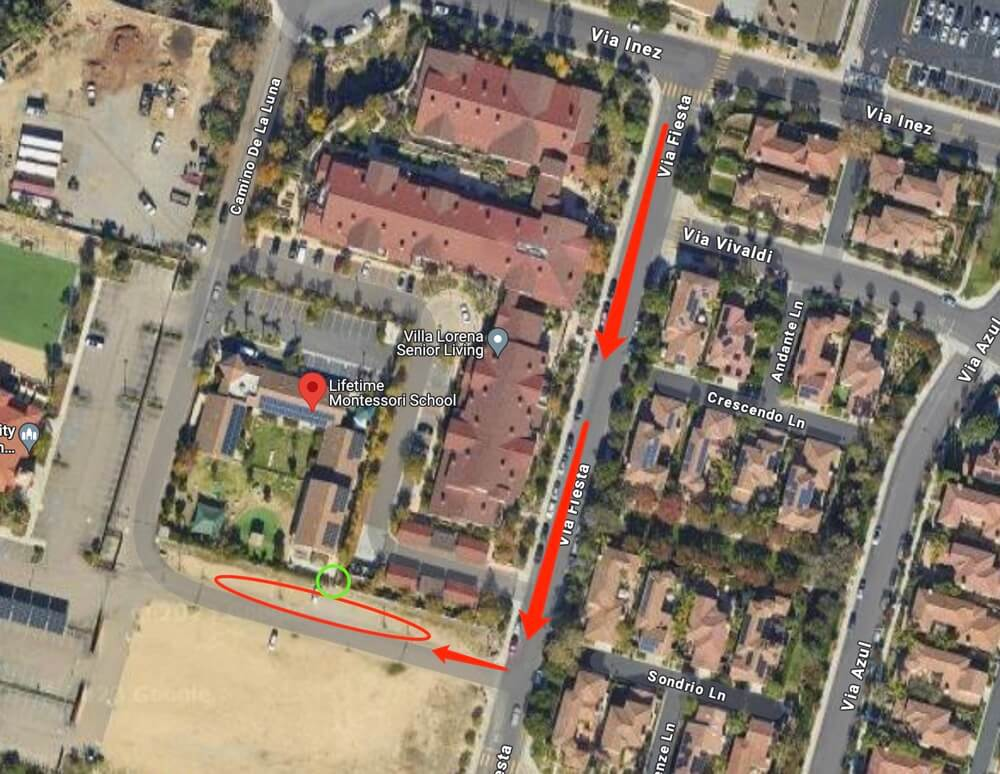

# 🚌 Lifetime Montessori — Pickup Instructions

**Address:** 14727 Camino De La Luna, San Diego, CA 92127  
**Last Verified:** 2025-08-11

---

## 📍 Pickup Spot
**Location:** Park the car at the **red circle** area on the map below.  
Then walk to the **green circle** area to pick up students. A teacher will assist in calling the student.  
You may need a **checkout code** — if required, call **Mr. Jeff** at 858-649-9760.

---

## 🛣️ Driver Route
1. Enter the parking area from Camino De La Luna.  
2. Park in the **red circle** location shown on the map.  
3. Walk to the **green circle** location to pick up students.  
4. After pickup, return to your vehicle and exit carefully.

---

## 🕒 Dismissal Times

| Grade Level | Everyday |
|-------------|----------|
| All Grades  | 2:45 PM  |

---

## ⚠ Safety Notes
- Lock your vehicle when leaving it to pick up students.  
- Ensure you have the necessary **checkout code** if required by the school.  
- Confirm students are buckled before leaving the parking lot.

---

## 📞 Contacts
- **Dispatch:** See your driver sheet for phone/text contact.  
- **Corrections to this page:** [yihengy@graceallstaracademy.com](mailto:yihengy@graceallstaracademy.com)  
- **School Pickup Contact:** Mr. Jeff — 858-649-9760

---

[⬅ Back to Location List](../Location_detail.md) | [🏠 Homepage](../README.md)
