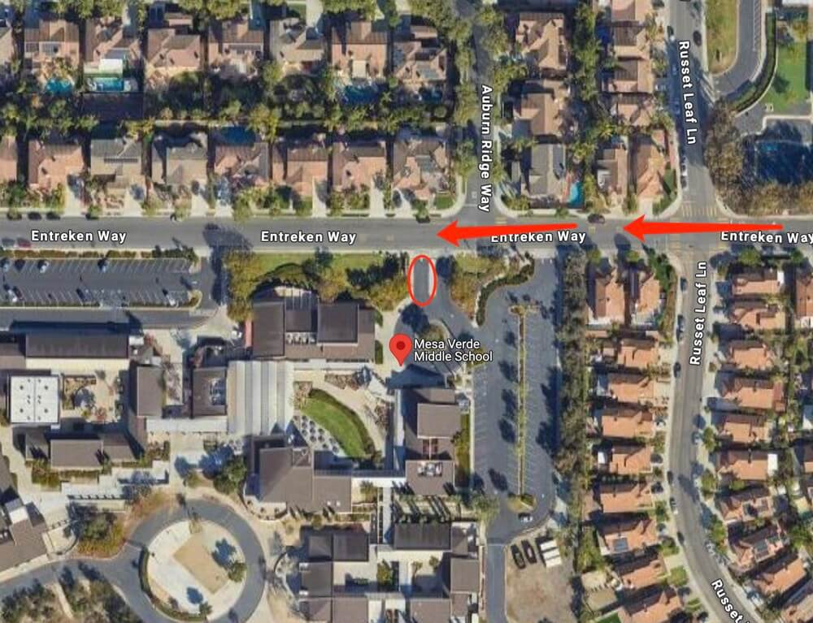

# 🚌 Mesa Verde Middle School — Pickup Instructions

**Address:** 8375 Entreken Way, San Diego, CA 92129  
**Last Verified:** 2025-08-11

---

## 📍 Pickup Spot
**Location:** Follow the **red arrow** route on the map to reach the **red circle** pickup area where students will be waiting.  
If you arrive very early and cannot access the pickup area due to school bus operations, park in the school parking lot and wait until it is clear to proceed.

---

## 🛣️ Driver Route
1. Enter from Entreken Way and follow the **red arrow** route on the map.  
2. Proceed to the **red circle** pickup area when allowed.  
3. If access is blocked due to school bus operations, wait in the parking lot until staff signals it is clear.  
4. Exit the school area carefully, following traffic directions.

---

## 🕒 Dismissal Times

| Grade Level | Everyday |
|-------------|----------|
| All Grades  | 2:25 PM  |

---

## ⚠ Safety Notes
- Follow school staff directions for traffic control.  
- Do not block buses or other vehicles during dismissal operations.  
- Ensure students are buckled before leaving the pickup zone.

---

## 📞 Contacts
- **Dispatch:** See your driver sheet for phone/text contact.  
- **Corrections to this page:** [yihengy@graceallstaracademy.com](mailto:yihengy@graceallstaracademy.com)

---

[⬅ Back to Location List](../Location_detail.md) | [🏠 Homepage](../README.md)
