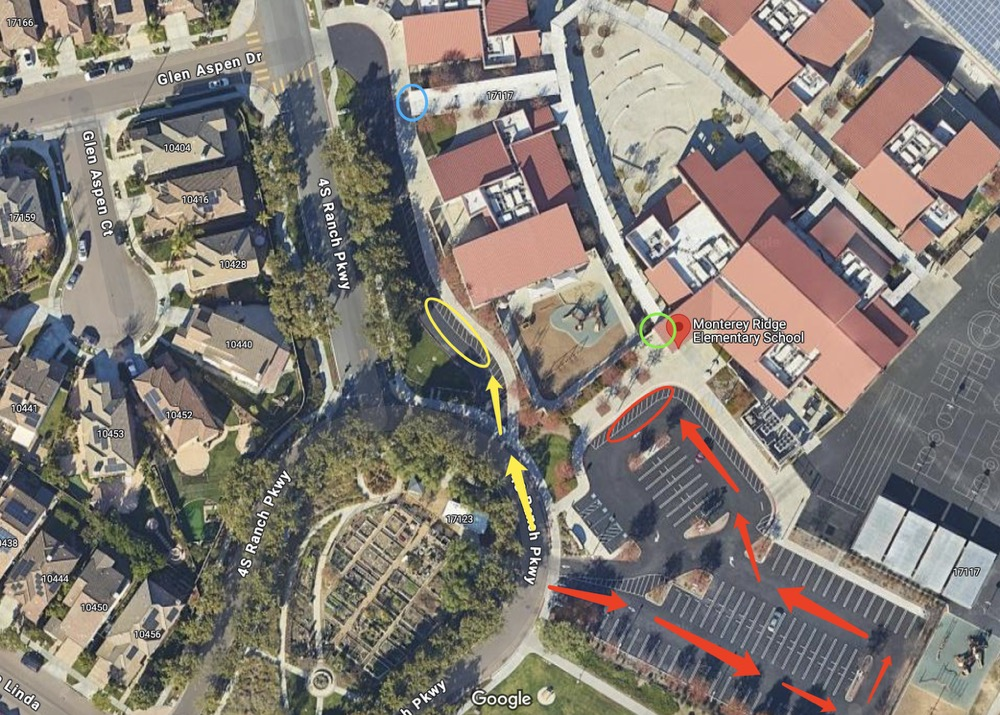

# 🚌 Monterey Ridge — Pickup Instructions

**Address:** 17117 4S Ranch Pkwy, San Diego, CA 92127  
**Last Verified:** 2025-08-11

---

## 📍 Pickup Spot
Pickup locations vary by grade level. See grade-specific instructions below.  

---

## 🛣️ Driver Route
- Enter the school driveway from 4S Ranch Pkwy.  
- Follow the specific route for your assigned grade group (see below).  
- Exit the driveway carefully, following school traffic rules.

---

## 🕒 Dismissal Times
| Grade Level | Mon / Tue / Wed / Fri | Thursday |
|-------------|-----------------------|----------|
| All Grades  | 3:05 PM               | 12:25 PM |

---

## 🧾 Student Pickup Instructions

### **TK**
- Park at the **red circle** curbside area.  
- Onsite teacher will bring the student out from the **green circle** area.  
- Walk to the **green circle** to pick up the student.

### **Kindergarten & Up**
- Park at the **yellow circle** curbside area.  
- Students will exit from the **blue circle** area.  
- Stand by your vehicle so students can locate you and walk to the car.

---

## ⚠ Safety Notes
- Only leave your vehicle when walking to the **green circle** for TK pickup.  
- Follow all onsite staff instructions for traffic and safety.  
- Ensure students are buckled before the vehicle moves.

---

## 📞 Contacts
- **Dispatch:** See your driver sheet for phone/text contact.  
- **Corrections to this page:** [yihengy@graceallstaracademy.com](mailto:yihengy@graceallstaracademy.com)

---

[⬅ Back to Location List](../Location_detail.md) | [🏠 Homepage](../README.md)
