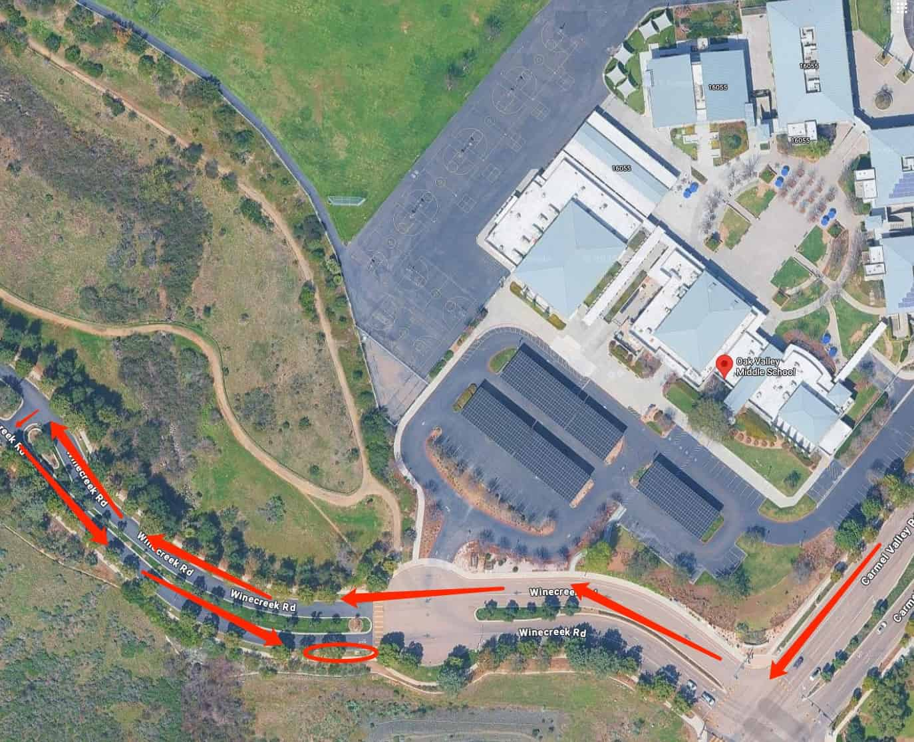

# 🚌 Oak Valley — Pickup Instructions

**Address:** 16055 Winecreek Rd, San Diego, CA 92127  
**Last Verified:** 2025-08-11

---

## 📍 Pickup Spot
**Location:** Follow the **red arrow** route on the map to the **red circle** curbside pickup area.  
Students will come to this location to find the school van.

---

## 🛣️ Driver Route
1. Enter from Winecreek Rd.  
2. Follow the **red arrow** route to the designated **red circle** curbside pickup zone.  
3. Remain in your vehicle — students will come to your location for pickup.  
4. Exit carefully, following school traffic flow.

---

## 🕒 Dismissal Times

| Grade Level | Everyday |
|-------------|----------|
| All Grades  | 2:30 PM  |

---

## ⚠ Safety Notes
- Follow the designated route — do not take shortcuts through parking areas.  
- Arrive on time to avoid blocking school traffic.  
- Ensure all students are buckled before leaving the pickup zone.

---

## 📞 Contacts
- **Dispatch:** See your driver sheet for phone/text contact.  
- **Corrections to this page:** [yihengy@graceallstaracademy.com](mailto:yihengy@graceallstaracademy.com)

---

[⬅ Back to Location List](../Location_detail.md) | [🏠 Homepage](../README.md)
