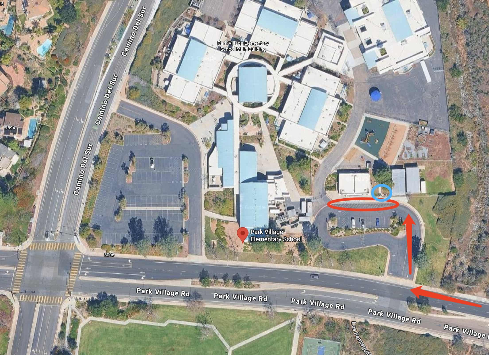

# 🚌 Park Village — Pickup Instructions

**Address:** 7930 Park Village Rd, San Diego, CA 92129  
**Last Verified:** 2025-08-11

---

## 📍 Pickup Spot
**Location:** Park the car by the curbside shown in the **red circle** on the map below.  
Then walk to the **blue circle** area to locate and pick up all assigned students.

---

## 🛣️ Driver Route
1. Enter from Park Village Rd and proceed toward the **red circle** pickup area.  
2. Park your vehicle at the designated curbside. (Ahead from school buses)  
3. Walk to the **blue circle** area to meet students.  
4. Return to your vehicle and exit carefully, following school traffic flow.

---

## 🕒 Dismissal Times

| Grade Level | Everyday |
|-------------|----------|
| All Grades  | 2:45 PM  |

---

## ⚠ Safety Notes
- Lock your vehicle before walking to the **blue circle** pickup area.  
- Follow all onsite staff instructions.  
- Ensure students are buckled before the vehicle moves.

---

## 📞 Contacts
- **Dispatch:** See your driver sheet for phone/text contact.  
- **Corrections to this page:** [yihengy@graceallstaracademy.com](mailto:yihengy@graceallstaracademy.com)

---

[⬅ Back to Location List](../Location_detail.md) | [🏠 Homepage](../README.md)
