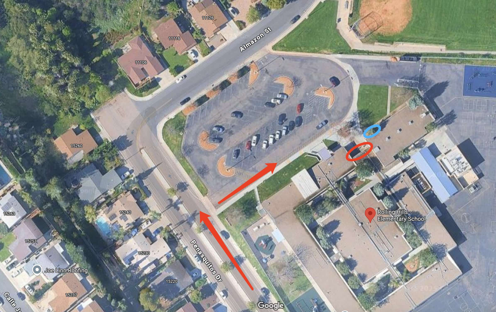

# 🚌 Rolling Hills — Pickup Instructions

**Address:** 15255 Penasquitos Dr, San Diego, CA 92129  
**Last Verified:** 2025-08-11

---

## 📍 Pickup Spot
**Location:** Park the car by the curb of the driveway or in the parking lot.  
Kindergarten students must be picked up from the **green circle** area, while 1st grade and older students will exit from the **red circle** area.

---

## 🛣️ Driver Route
1. Enter from Penasquitos Dr and proceed to the designated curbside or parking lot space.  
2. Park your vehicle.  
3. Walk to the **green circle** to pick up Kindergarten students.  
4. 1st grade and older students will come directly from the **red circle** area to your vehicle.  
5. Exit carefully, following school traffic flow.

---

## 🕒 Dismissal Times

| Grade Level | Everyday |
|-------------|----------|
| All Grades  | 1:45 PM  |

---

## ⚠ Safety Notes
- Lock your vehicle before walking to the **green circle** for Kindergarten pickup.  
- Follow all staff instructions for safe and efficient dismissal.  
- Ensure all students are buckled before leaving the pickup area.

---

## 📞 Contacts
- **Dispatch:** See your driver sheet for phone/text contact.  
- **Corrections to this page:** [yihengy@graceallstaracademy.com](mailto:yihengy@graceallstaracademy.com)

---

[⬅ Back to Location List](../Location_detail.md) | [🏠 Homepage](../README.md)
