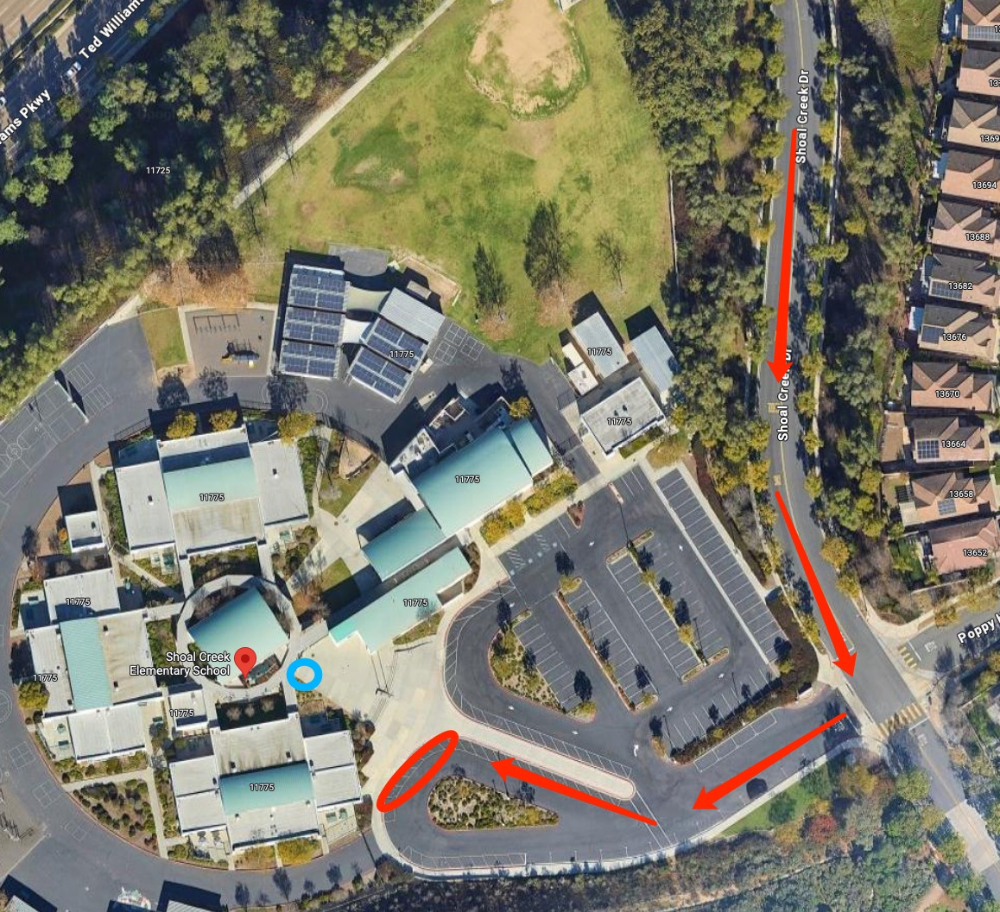

# 🚌 Shoal Creek — Pickup Instructions

**Address:** 11775 Shoal Creek Dr, San Diego, CA 92128  
**Last Verified:** 2025-08-25

---

## 📍 Pickup Spot
**Location:** Follow along the **red arrows** to enter the parking lot and park at the **red circle**, the student will come out from the **blue circle** gate and find our van. (Notice, we should stand outside and let the teacher to see you to send the student to your van)

---

## 🛣️ Driver Route
1. Enter from Shoal Creek Dr.  
2. If parking in the **red circle** parking lot, ensure your vehicle is locked.  
3. Students will exit from the **blue circle** location and come to your vehicle.  
4. Exit carefully, following the school’s traffic flow.

---

## 🕒 Dismissal Times

| Grade Level | Mon / Tue / Wed / Fri | Thursday |
|-------------|-----------------------|----------|
| All Grades  | 2:05 PM               | 12:25 PM |

---

## ⚠ Safety Notes 
- Follow school staff instructions for safe dismissal.  
- Ensure students are buckled before leaving the pickup zone.

---

## 📞 Contacts
- **Dispatch:** See your driver sheet for phone/text contact.  
- **Corrections to this page:** [yihengy@graceallstaracademy.com](mailto:yihengy@graceallstaracademy.com)

---

[⬅ Back to Location List](../Location_detail.md) | [🏠 Homepage](../README.md)
