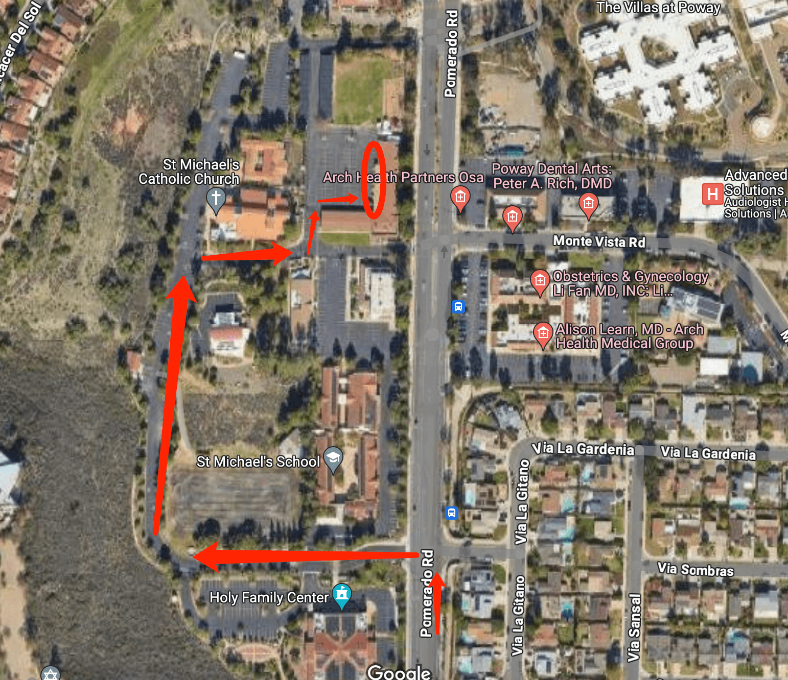

# 🚌 St. Michael — Pickup Instructions

**Address:** 15546 Pomerado Rd, Poway, CA 92064  
**Last Verified:** 2025-08-11

---

## 📍 Pickup Spot
**Location:** Follow the **red arrow** route on the map to the **red circle** pickup area.  
A teacher will assist in calling the student to your vehicle. This is a **drive-thru pickup zone** — remain in your car.

---

## 🛣️ Driver Route
1. Enter the school property from Pomerado Rd.  
2. Follow the **red arrow** path (as shown on the map) to the **red circle** pickup area.  
3. Remain in your vehicle while staff brings students to you.  
4. Exit carefully, following school traffic instructions.

> **Note:** Do **not** rely solely on Google Maps directions — they may not match the actual pickup route.

---

## 🕒 Dismissal Times

| Grade Level | Mon / Tue / Wed / Thu | Friday  |
|-------------|-----------------------|---------|
| All Grades  | 2:45 PM               | 12:00 PM|

---

## ⚠ Safety Notes
- Remain in your vehicle in the pickup lane.  
- Follow staff instructions for safe traffic flow.  
- Ensure students are buckled before leaving the pickup zone.

---

## 📞 Contacts
- **Dispatch:** See your driver sheet for phone/text contact.  
- **Corrections to this page:** [yihengy@graceallstaracademy.com](mailto:yihengy@graceallstaracademy.com)

---

[⬅ Back to Location List](../Location_detail.md) | [🏠 Homepage](../README.md)
