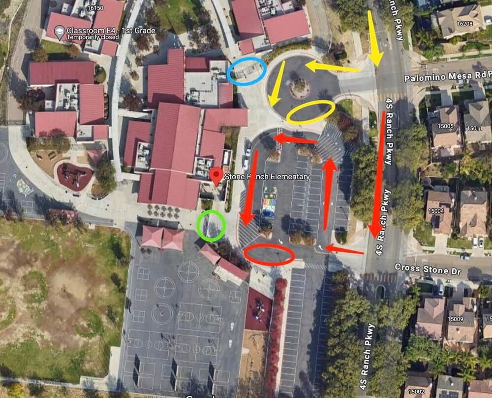

# 🚌 Stone Ranch — Pickup Instructions

**Address:** 16150 4S Ranch Pkwy, San Diego, CA 92127  
**Last Verified:** 2025-08-11

---

## 📍 Pickup Spot
Pickup locations vary by grade level. See grade-specific instructions below.  

---

## 🛣️ Driver Route
- Enter the school driveway from 4S Ranch Pkwy.  
- Follow the designated route to your assigned pickup location based on the student’s grade.  
- Exit carefully, following the school’s traffic rules.

---

## 🕒 Dismissal Times

| Grade Level | Mon / Tue / Wed / Fri | Thursday |
|-------------|-----------------------|----------|
| All Grades  | 2:05 PM               | 12:25 PM |

---

## 🧾 Student Pickup Instructions

### **TK**
- Park at the **red circle** curbside area.  
- Students will exit from the **green circle** area.  
- Walk to the **green circle** to pick up the student.

### **Kindergarten & Up**
- Park at the **yellow circle** curbside area.  
- Pick up Kindergarten students from the **green circle** first.  
- Other students will exit from the **blue circle** area and walk to your car.

---

## ⚠ Safety Notes
- Only leave your vehicle when walking to the **green circle** for TK or K pickup.  
- Stand beside your vehicle so students can easily spot you.  
- Ensure students are buckled before the vehicle moves.

---

## 📞 Contacts
- **Dispatch:** See your driver sheet for phone/text contact.  
- **Corrections to this page:** [yihengy@graceallstaracademy.com](mailto:yihengy@graceallstaracademy.com)

---

[⬅ Back to Location List](../Location_detail.md) | [🏠 Homepage](../README.md)
