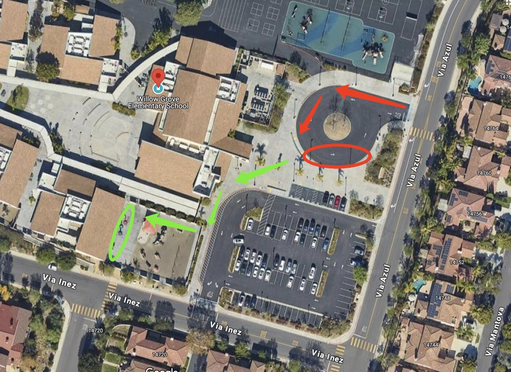

# 🚌 Willow Grove — Pickup Instructions

**Address:** 14727 Via Azul, San Diego, CA 92127  
**Last Verified:** 2025-08-11

---

## 📍 Pickup Spot
**Location:** Park the car by the curb of the driveway shown in the **red circle** on the map below.  
Kindergarten students must be picked up from the **green circle** area.

---

## 🛣️ Driver Route
1. Enter the driveway from Via Azul and proceed to the **red circle** pickup area.  
2. Park in the designated curbside location.  
3. Walk to the **green circle** to pick up Kindergarten students.  
4. Exit carefully, following the school’s traffic flow.

---

## 🕒 Dismissal Times
| Grade Level | Mon / Tue / Wed / Fri | Thursday |
|-------------|-----------------------|----------|
| All Grades  | 3:05 PM               | 1:25 PM  |

---

## ⚠ Safety Notes
- Lock your vehicle before walking to the **green circle**.  
- Follow all school staff traffic and dismissal guidance.  
- Ensure students are buckled before leaving the pickup area.

---

## 📞 Contacts
- **Dispatch:** See your driver sheet for phone/text contact.  
- **Corrections to this page:** [yihengy@graceallstaracademy.com](mailto:yihengy@graceallstaracademy.com)

---

[⬅ Back to Location List](../Location_detail.md) | [🏠 Homepage](../README.md)
